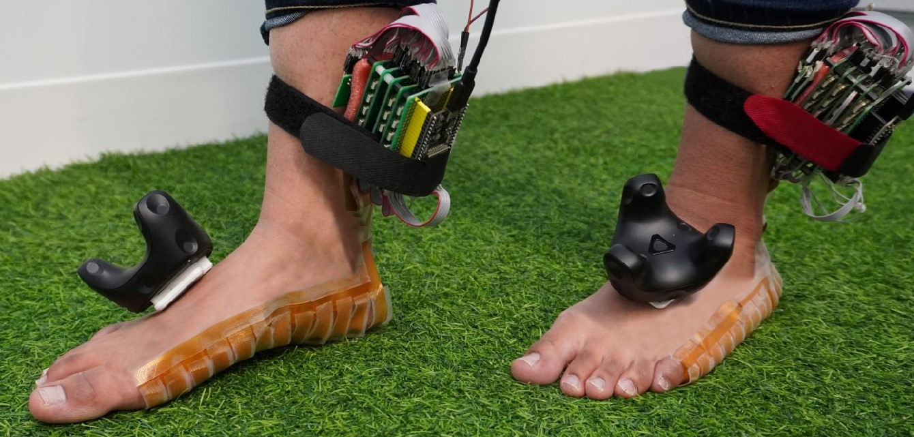
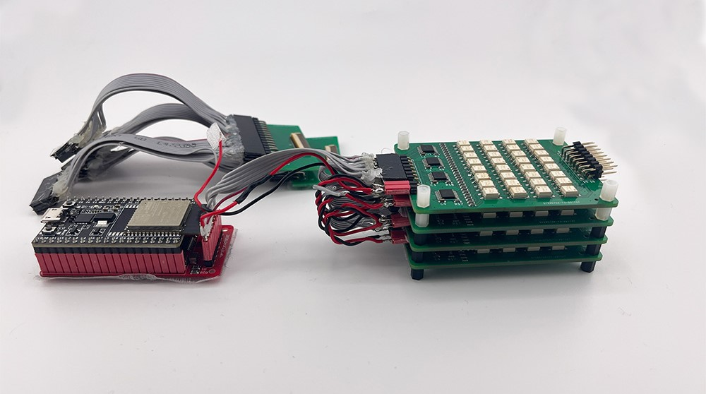

# FeetThrough: Electrotactile Foot Interface that Preserves Real-World Sensations

This is the repository for PCB schematics and code for electrical stimulation used in the "FeetThrough: Electrotactile Foot Interface that Preserves Real-World Sensations" paper (ACM UIST2023).

**Summary**: FeetThrough is an open-source device that allows you to control external applications. Its hardware is built on an ESP32 microcontroller (you can use your favorite microcontroller), a custom-built multiplexer, and an electrical stimulator (we used the medical-grade Rehastim). We provide schematics for electrodes, multiplexers, and simple Python codes for electrical stimulation. By implementing a multiplexer and preparing a stimulator, you can test electrical stimulation for feet. Regarding the details of the electrode design, please refer to our paper.



## hardware

We share schematics of multiplexer board, flexible electrodes, and connector of the electrodes.

-  multiplexer: `hardware/photorelay_multiplexer`
   - This multiplexer is mainly consisted of shift registers (74HC595) and high-voltage photorelays (TLP176GA), and half-bridge configuration is created for each electrode

- electrodes: `hardware/electrodes` and `hardware/flexible_pcb_connector`
  - to use flexible electrodes, flexible PCB connector (FPC) is needed to deliver stimulation. We designed the end of the electrodes for this connector (FH12-30S-0.5SH(55), [mouser](https://mou.sr/3Qu7VoI)).
  - `app_electrodes_top` and `app_electrodes_bottom` are the final prototype of the electrodes to deliver stimulation to the whole sole. (To use 30-ch connector, the electrodes are separated in half)
  - To test the stimulator, you do not have to create flexible PCB electrodes. You can also use gel electrodes (often used for EMS) and other types of the electrodes if they are able to connect to the multiplexer

- stimulator (current source)
  - While we used the medical-grade RehaStim, you can use other electrical stimulators such as [RehaMove](https://github.com/humancomputerintegration/rehamove-integration-lib), [openEMSstim](https://github.com/PedroLopes/openEMSstim), [Electro-Tactile Display Kit for Fingertip (Kajimoto 2021)](https://ieeexplore.ieee.org/abstract/document/9517192).
  - connect the current source to `V+` and `V-` in the circuit.
  - We show another example of implementation with [a stimulator of Kajimoto 2021](https://ieeexplore.ieee.org/abstract/document/9517192)
  - 

## source code

We share software code to stimulate multiple electrodes. To use the code, you have to prepare your stimulator and implement client for it. This code was developed for Windows 11

- client: `code/simple_stimulation`
  - `main.py`: simple controller of electrical stimulation
  - `custom_serial.py`: client for microcontroller of multiplexer
  - `photo_relay_switching.py`: Each channel of the multiplexer has three states (HIGH (V+), LOW (V-), OPEN (not connected)). This program manages and changes the states of multiplexer in software
  - `electro_stimulator.py`: client for electrical stimulator. This program controlls stimulation frequency and synchronize the timing between multiplexing and stimulator. 

in `electro_stimulator.py`, please change the code to use your stimulator

```python:electro_stimulator.py
# client for electrical stimulator ----- 
# NEED IMPLEMENTATION
client = ## please implement a client for your stimulator
## ------------------ 
```

```python:electro_stimulator.py
# --- send one pulse ---
# NEED IMPLEMENTATION
# client.write()
# --------
```

## how to use

- upload `arduino/multiplexer_esp32` to a microcontroller (ESP32 DevKitC 32E, [mouser](https://mou.sr/3GRjfHH)) through Arduino Software
  - before running the code, check and change `baudrate` and `com port` in `custom_serial.py`
- connect multiplexer and electrical stimulator to your PC
- run `main.py` in `code/simple_stimulation`

## contact

For any questions about this repository, please contact Keigo Ushiyama (ushiyama@kaji-lab.jp)

## citation

When using or building upon this work in an academic publication, please consider citing as follows:

Keigo Ushiyama and Pedro Lopes. 2023. FeetThrough: Electrotactile Foot Interface that Preserves Real-World Sensations. In Proceedings of the 36th Annual ACM Symposium on User Interface Software and Technology (UIST '23). Association for Computing Machinery, New York, NY, USA, Article 10, 1–11. https://doi.org/10.1145/3586183.3606808

